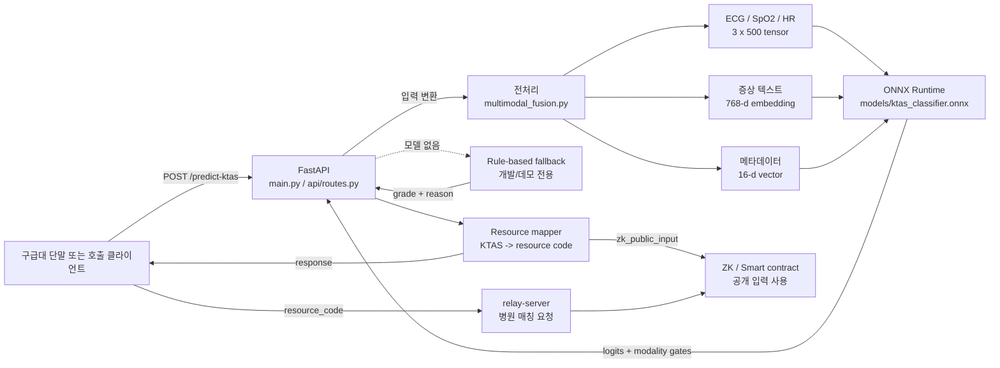
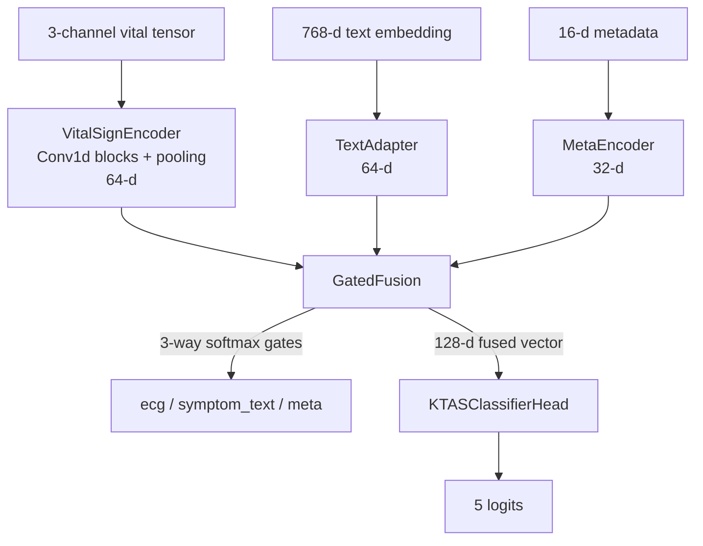
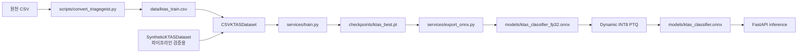

# AI Engine Architecture

## 1. 책임 범위

`ai-engine`은 환자 입력을 KTAS 1~5 등급으로 분류하는 추론 서비스입니다. 분류 결과를 GoldenLock 백엔드가 사용할 의료 자원 코드와 ZK 공개 입력으로 변환해 반환합니다.

서비스가 책임지는 범위:

- 입력 스키마 검증
- 활력징후, 증상 텍스트, 환자 메타데이터 전처리
- ONNX 기반 추론
- 모델 미탑재 시 데모용 규칙 기반 폴백
- KTAS 결과의 자원 코드 변환

서비스 밖의 책임:

- 병원 자원 등록 및 실시간 매칭: `backend/relay-server`
- 자원 확약 및 온체인 상태: `backend/contracts`
- 실제 ZK 증명 생성/검증 회로: 별도 회로 및 verifier 구성
- 임상적 최종 판단: 의료진 및 운영 프로토콜

## 2. 전체 구성

## 3. 요청 처리 흐름

1. `api/routes.py`가 `KTASPredictRequest`로 `vitals`, `symptom_text`, `meta`를 검증합니다.
2. `models/ktas_classifier.onnx`가 존재하면 ONNX Runtime 세션을 지연 생성하고 CPU 실행 provider로 재사용합니다.
3. 모델 경로가 없으면 `rule_based_fallback.rule_based_ktas`가 SpO2, HR, 나이 임계값을 이용해 데모 등급을 계산합니다.
4. 모델 경로에서는 `multimodal_fusion.build_input_tensor`가 세 입력을 모델 입력 배열로 바꿉니다.
5. 모델은 `logits`와 `modality_gates`를 반환합니다. logits에 softmax를 적용해 가장 높은 확률의 인덱스를 KTAS 등급으로 변환합니다.
6. `resource_mapper.map_ktas_to_resource`가 등급을 자원 코드와 우선순위로 변환합니다.
7. `to_zk_public_input`이 `0x01`~`0x05` 코드를 정수 `1`~`5`로 바꿉니다.
8. API는 분류 결과, confidence, 모달리티 기여도, 결과 출처, 경고를 하나의 응답으로 반환합니다.

## 4. 모달리티 전처리와 모델 계약

### 입력 계약

| 입력 이름 | 원본 | 변환 결과 | 모델 차원 |
|---|---|---|---|
| `ecg` | `ecg`, `spo2`, `hr` 리스트 | 길이 500 조정, 밴드패스 필터, Z-score 정규화 | `(batch, 3, 500)` |
| `text_emb` | `symptom_text` 문자열 | Sentence Transformer 임베딩 | `(batch, 768)` |
| `meta` | `age`, `sex`, `history` | 나이 정규화, 성별 one-hot, 과거력 벡터 | `(batch, 16)` |

현재 `encode_meta`는 정의된 과거력 vocabulary를 벡터화하고 남은 차원을 0으로 padding합니다. 모델 입력 차원을 변경할 경우 학습 모델, ONNX export dummy input, API 전처리를 함께 변경해야 합니다.

### 모델 내부

`GatedFusion`은 세 임베딩을 각각 128차원으로 투영한 뒤, 입력에 따라 계산한 3개 gate로 가중합합니다. `modality_gates`는 설명 보조 지표이며, 의료적 설명 가능성이나 인과적 기여도를 보장하지 않습니다.

## 5. 학습 및 배포 파이프라인

학습은 weighted focal loss를 사용하며 KTAS 1~2에 더 높은 기본 class weight를 적용합니다. 검증 시 macro F1과 KTAS 1/2 recall을 출력하고, macro F1이 가장 높은 체크포인트를 저장합니다.

배포 산출물은 `models/ktas_classifier.onnx`이며, 서빙 코드의 기본 경로와 일치해야 합니다. INT8 변환 전 FP32 ONNX 구조 검증이 수행됩니다.

## 6. 백엔드 계약

### 자원 코드 매핑

| KTAS 등급 | `resource_code` | `zk_public_input` | 의미 |
|---:|---|---:|---|
| 1 | `0x01` | 1 | 즉시 수술실 + 중환자실(소생) |
| 2 | `0x02` | 2 | 중환자실(긴급) |
| 3 | `0x03` | 3 | 응급병상 + 전문의(응급) |
| 4 | `0x04` | 4 | 일반병상(준응급) |
| 5 | `0x05` | 5 | 외래 대기(비응급) |

`resource_code`는 relay-server의 매칭 요청에 사용하고, `zk_public_input`은 ZK 회로/Verifier의 공개 입력과 연결합니다. 이 매핑은 프론트엔드 표시용 문자열이 아니라 서비스 간 계약입니다.

## 7. 실패 및 폴백 정책

| 상황 | 현재 동작 | 응답 |
|---|---|---|
| ONNX 파일 없음 | 규칙 기반 폴백 실행 | `source=rule_based_fallback`, `warning` 포함 |
| 텍스트 인코더 로드 실패 | 768차원 0 벡터 사용 | 모델 추론은 계속 시도 |
| ONNX 세션 로드/추론 예외 | 예외 처리 후 HTTP 500 | `detail`에 추론 실패 메시지 |
| KTAS 외 등급 매핑 | `ValueError` 발생 | HTTP 500 처리 경로 |

폴백은 시스템 데모의 연속성을 위한 장치입니다. 운영에서는 모델 미탑재나 인코더 실패를 배포 실패로 간주하고, 경고를 숨기지 않으며, 임상 업무로 결과가 전달되지 않도록 별도 차단 정책을 두어야 합니다.

## 8. 확장 시 변경 지점

- 입력 센서 추가: `services/multimodal_fusion.py`, `services/ktas_model.py`, `services/export_onnx.py`
- 메타데이터 차원 변경: `encode_meta`, `KTASMultimodalNet(meta_in_dim=...)`, export dummy input
- 실제 텍스트 인코더 교체: 임베딩 차원, 모델 `TextAdapter`, 런타임 모델 배포 정책 동시 변경
- 새로운 자원 유형 추가: `services/resource_mapper.py`, relay-server 타입, ZK 공개 입력 규격 동시 변경
- 임상 규칙 교체: `rule_based_fallback.py`를 의료진 검증 규칙으로 교체하고 별도 테스트/버전 관리
- 모델 품질 게이트 추가: confidence threshold, calibration, KTAS 1/2 recall 기준을 API 배포 전 검증 단계에 추가

## 9. 보안 및 운영 고려사항

- 환자 입력은 민감정보로 취급하고 로그에 원문 증상, 생체신호, 과거력을 남기지 않아야 합니다.
- API 인증과 서비스 간 TLS를 적용해야 합니다.
- ONNX 파일은 배포 시 해시 또는 서명으로 무결성을 검증해야 합니다.
- 모델 버전, 데이터셋 버전, 전처리 버전, 평가 결과를 응답 추적 ID와 연결해야 합니다.
- rate limit, timeout, request size limit, readiness/health probe를 운영 환경에 맞게 추가해야 합니다.
- 현재 `/health`는 프로세스 생존만 확인합니다. 운영 readiness에서는 모델 파일과 세션, 텍스트 인코더 상태를 별도로 점검하는 것이 적절합니다.
